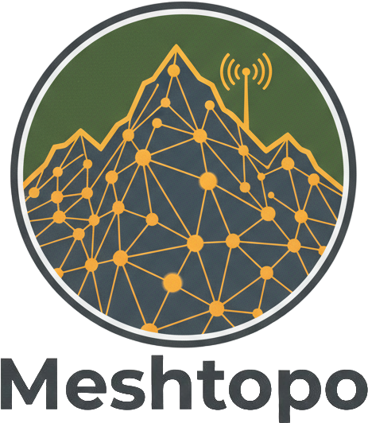

# Meshtopo - Meshtastic to CalTopo Gateway

<p align="center">
  
</p>

A lightweight Python gateway service that bridges Meshtastic LoRa mesh networks with CalTopo mapping platforms, enabling real-time position tracking of field assets on high-quality maps.

## Overview

**Meshtopo** solves the communication gap between off-grid LoRa mesh networks (Meshtastic) and online mapping platforms (CalTopo). It acts as a reliable bridge that forwards location data from Meshtastic nodes directly to CalTopo maps, providing real-time situational awareness for backcountry coordinators, event organizers, and response teams.

## Features

- **Real-time Position Forwarding**: Automatically forwards Meshtastic position packets to CalTopo
- **Automatic Device Registration**: Devices automatically appear in CalTopo Team Account using their callsigns
- **Intelligent Node Mapping**: Maps Meshtastic numeric node IDs to hardware IDs, then to callsigns
- **Flexible API Support**: Supports both CalTopo Team Account (connect_key) and custom integration (GROUP-based) APIs
- **Device Access Control**: Configurable control over unknown device position updates
- **Internal MQTT Broker**: Optional integrated Mosquitto broker with configurable users and ACL
- **Robust Error Handling**: Graceful handling of network issues and API failures
- **Docker Deployment**: Easy deployment with Docker and Docker Compose
- **Comprehensive Logging**: Detailed logging for monitoring and debugging
- **Lightweight Design**: Minimal resource footprint for edge deployment

## Architecture

The system follows a simple linear data flow:

1. **Meshtastic Network** → LoRa mesh nodes with MQTT gateway
2. **MQTT Broker** → Central message broker (e.g., Mosquitto)
3. **Gateway Service** → This Python service (filters, transforms, forwards)
4. **CalTopo Team Account** → Cloud mapping platform with automatic device registration

## Quick Start

### Prerequisites

- Python 3.9+ or Docker
- Access to an MQTT broker with Meshtastic data
- CalTopo Team Account with access URL

### Obtaining CalTopo Connect Key

1. Log into your CalTopo Team Account Administration page
2. Navigate to **Trackable Devices** → **Access URLs**
3. Copy the connect key from your team's access URL
4. The connect key looks like: `aoJpFiwnxxgGEuaMY6W0gcqdeQ3T2bjoQfzvWbduT9LjJ`

### Docker Deployment (Recommended)

1. **Clone and configure**:

    ```bash
    git clone https://github.com/clayauld/meshtopo.git
    cd meshtopo
    cp config/config.yaml.docker config/config.yaml
    # Edit config/config.yaml with your settings
    ```

2. **Start the service**:

    ```bash
    docker-compose up -d
    ```

3. **View logs**:

    ```bash
    docker-compose logs -f
    ```

### Internal MQTT Broker Setup

Meshtopo can optionally run its own Mosquitto MQTT broker:

1. **Enable internal broker in config.yaml**:

    ```yaml
    mqtt_broker:
        enabled: true
        port: 1883
        websocket_port: 9001
        persistence: true
        max_connections: 1000
        allow_anonymous: false
        users:
            - username: "meshtopo"
              password: "secure_password"
              acl: "readwrite"
        acl_enabled: false
    ```

2. **Generate broker configuration**:

    ```bash
    make setup-broker
    # or manually:
    python3 scripts/generate_mosquitto_config.py
    ```

3. **Start the broker**:

    ```bash
    docker-compose up -d mosquitto
    ```

4. **Configure gateway to use internal broker**:

    ```yaml
    mqtt:
        broker: "mosquitto" # Docker service name
        port: 1883
        username: "meshtopo"
        password: "secure_password"
        topic: "msh/US/2/json/+/+"
        use_internal_broker: true
    ```

### Manual Installation

1. **Install dependencies**:

    ```bash
    pip install -r requirements.txt
    ```

2. **Configure the service**:

    ```bash
    cp config/config.yaml.basic config/config.yaml
    # Edit config/config.yaml with your MQTT and CalTopo settings
    ```

3. **Run the gateway**:

    ```bash
    python src/gateway.py
    ```

## Configuration

The service is configured via `config/config.yaml`. Multiple configuration templates are available for different deployment scenarios:

### Configuration Templates

- **`config.yaml.example`** - Complete reference with all options documented
- **`config.yaml.basic`** - Simple setup for getting started
- **`config.yaml.minimal`** - Bare minimum for testing and development
- **`config.yaml.docker`** - Optimized for Docker/containerized deployments
- **`config.yaml.production`** - Production-ready with enhanced security and logging

### Quick Setup

1. **Choose a template** based on your deployment needs:

    ```bash
    # For basic setup
    cp config/config.yaml.basic config/config.yaml

    # For Docker deployment
    cp config/config.yaml.docker config/config.yaml

    # For production
    cp config/config.yaml.production config/config.yaml
    ```

2. **Edit the configuration** with your specific settings

### Configuration Structure

```yaml
# MQTT Broker Configuration
mqtt:
    broker: "192.168.1.100"
    port: 1883
    username: "your_mqtt_user"
    password: "your_mqtt_password"
    topic: "msh/US/2/json/+/+"

# CalTopo Team Account Configuration
caltopo:
    connect_key: "G3rvYRwG3TtrQVyUIB3WKfbyzFqSfUldGDxC4blVzrkte"
    api_mode: "connect_key" # or "group"
    group: "SARTEAM" # required if api_mode is "group"

# Optional: Node display name overrides
nodes:
    "!823a4edc":
        device_id: "TEAM-LEAD"
        group: "LEADERSHIP" # optional per-device GROUP override
    "!a4b8c2f0":
        device_id: "COMMS-1"

# Device Management
devices:
    allow_unknown_devices: true # Allow unknown devices to send position updates
```

**Note**: Replace `US` in the topic with your LoRa region code. See [Meshtastic LoRa Region by Country](https://meshtastic.org/docs/configuration/region-by-country/) for the correct region code for your country.

### CalTopo API Modes

Meshtopo supports two CalTopo API authentication methods:

#### Team Account Mode (connect_key)

- Uses CalTopo Team Account connect key
- Format: `https://caltopo.com/api/v1/position/report/{CONNECT_KEY}?id={DEVICE_ID}&lat={LAT}&lng={LNG}`
- Automatic device registration in Team Account
- Default mode for backward compatibility

#### Custom Integration Mode (group)

- Uses GROUP-based authentication for custom integrations
- Format: `https://caltopo.com/api/v1/position/report/{GROUP}?id={DEVICE_ID}&lat={LAT}&lng={LNG}`
- Supports global GROUP with optional per-device GROUP overrides
- Requires manual device setup in CalTopo

### Device Registration

Meshtopo uses CalTopo's Team Account access URL feature for automatic device registration:

1. **Automatic Registration**: When a Meshtastic node first reports its position, it automatically appears in your CalTopo Team Account
2. **Callsign Identification**: Devices are identified by their Meshtastic `longname` field (callsign)
3. **Display Name Override**: Optionally configure custom display names in the `nodes` section
4. **No Pre-registration**: No need to manually add devices to CalTopo

### Node Mapping Mechanism

Meshtopo uses an intelligent two-tier mapping system to handle different Meshtastic message types:

#### 1. Primary Mapping (Nodeinfo Messages)

When `nodeinfo` messages are received, the gateway builds a mapping from numeric node IDs to hardware IDs:

```json
{
    "from": 862485920,
    "type": "nodeinfo",
    "payload": {
        "id": "!33687da0",
        "longname": "AMRG3-Heltec"
    }
}
```

This creates: `862485920` → `!33687da0` → `AMRG3-Heltec`

#### 2. Fallback Mapping (Position Messages)

When position messages arrive before nodeinfo messages, the gateway uses the `sender` field as a fallback:

```json
{
    "from": 862485920,
    "sender": "!33687da0",
    "type": "position",
    "payload": {
        "latitude_i": 612188460,
        "longitude_i": -1499001320
    }
}
```

This automatically maps: `862485920` → `!33687da0`

#### 3. Callsign Resolution

The final step determines the callsign for CalTopo:

1. **Configured Override**: If the hardware ID is in the `nodes` config, use the configured `device_id`
2. **Meshtastic Longname**: Otherwise, use the `longname` from nodeinfo messages
3. **Fallback to Shortname**: If no longname, use the `shortname`

**Complete mapping chain**: `862485920` → `!33687da0` → `AMRG3` (or configured name)

This ensures position updates are never missed, even when nodeinfo messages are delayed or unavailable.

### Device Access Control

Meshtopo provides configurable control over unknown device behavior:

- **`allow_unknown_devices: true`** (default): Unknown devices are tracked and can send position updates
- **`allow_unknown_devices: false`**: Unknown devices are tracked but position updates are blocked

When `allow_unknown_devices` is `false`, unknown devices will:

1. Still be tracked and logged (nodeinfo messages processed)
2. Have their position updates blocked with a warning logged
3. Not appear in CalTopo until explicitly added to the `nodes` configuration

### Configuration Parameters

- **mqtt.broker**: IP address or hostname of your MQTT broker
- **mqtt.port**: MQTT broker port (default: 1883)
- **mqtt.username/password**: MQTT authentication credentials
- **mqtt.topic**: MQTT topic pattern for Meshtastic position packets (replace `US` with your LoRa region code)
- **caltopo.connect_key**: Your CalTopo Team Account connect key
- **caltopo.api_mode**: API mode - "connect_key" (default) or "group"
- **caltopo.group**: Global GROUP for group-based API mode
- **nodes**: Optional mapping of Meshtastic hardware IDs to custom display names
- **nodes[].group**: Optional per-device GROUP override for group-based API mode
- **devices.allow_unknown_devices**: Allow unknown devices to send position updates (default: true)

### LoRa Region Codes

The region code in the MQTT topic must be replaced with the appropriate LoRa region code for your country. Common region codes include:

- **US** - United States
- **EU_868** - European Union (868 MHz)
- **ANZ** - Australia/New Zealand
- **CN** - China
- **JP** - Japan
- **KR** - Korea
- **IN** - India
- **BR_902** - Brazil
- **RU** - Russia

For the complete list of region codes by country, see the [Meshtastic LoRa Region by Country documentation](https://meshtastic.org/docs/configuration/region-by-country/).

## Data Flow

1. **Meshtastic nodes** broadcast position data via LoRa
2. **MQTT Gateway** forwards data to MQTT broker
3. **Gateway Service** subscribes to position topics
4. **Position packets** are parsed and validated
5. **CalTopo Team Account** receives formatted position reports
6. **CalTopo maps** display real-time positions with automatic device registration

## API Integration

### Meshtastic Input Format

The service processes JSON position packets from Meshtastic:

```json
{
    "from": "!823a4edc",
    "type": "position",
    "payload": {
        "latitude_i": 612188460,
        "longitude_i": -1499001320
    }
}
```

### CalTopo Output Format

Position data is forwarded to CalTopo via HTTP GET using the configured API mode:

**Team Account Mode (connect_key)**:

```
https://caltopo.com/api/v1/position/report/{CONNECT_KEY}?id={CALLSIGN}&lat={LAT}&lng={LNG}
```

**Custom Integration Mode (group)**:

```
https://caltopo.com/api/v1/position/report/{GROUP}?id={DEVICE_ID}&lat={LAT}&lng={LNG}
```

## Error Handling

The service includes comprehensive error handling:

- **MQTT Disconnection**: Automatic reconnection with exponential backoff
- **Invalid JSON**: Malformed packets are logged and discarded
- **Unmapped Nodes**: Unknown node IDs are logged at DEBUG level
- **API Failures**: CalTopo API errors are logged with full details
- **Network Issues**: Graceful handling of connectivity problems

## Logging

The service provides detailed logging at multiple levels:

- **INFO**: Successful operations and status updates
- **WARN**: Recoverable errors and reconnection attempts
- **ERROR**: API failures and critical errors
- **DEBUG**: Detailed debugging information

## Development

### Project Structure

```
meshtopo/
├── assets/             # Static assets
│   └── images/         # Logo and image files
│       ├── Meshtopo-logo.png # Main logo with text
│       ├── Meshtopo-logo-no-type.png # Logo without text
│       └── Meshtopo-logo.xcf # Source file (GIMP)
├── config/             # Configuration files
│   ├── config.py       # Configuration management
│   ├── config.yaml.example # Complete configuration reference
│   ├── config.yaml.basic # Simple setup template
│   ├── config.yaml.minimal # Testing template
│   ├── config.yaml.docker # Docker deployment template
│   ├── config.yaml.production # Production template
│   └── README.md       # Configuration documentation
├── deploy/             # Deployment files
│   ├── Dockerfile      # Container definition
│   ├── docker-compose.yml # Docker Compose configuration
│   └── meshtopo.service # Systemd service file
├── docs/               # Documentation
│   └── design.md       # Design documentation
├── scripts/            # Shell scripts
│   └── install.sh      # Installation script
├── src/                # Python source code
│   ├── gateway.py      # Main application entry point
│   ├── gateway_app.py  # Main application class
│   ├── mqtt_client.py  # MQTT communication
│   └── caltopo_reporter.py # CalTopo API integration
├── tests/              # Test suite
├── requirements.txt    # Python dependencies
├── pyproject.toml      # Project configuration
├── Makefile           # Development commands
└── README.md          # This file
```

### Running Tests

```bash
python -m pytest tests/
```

### Code Style

The project follows PEP 8 guidelines with automatic formatting via `black`:

```bash
black .
```

## Deployment

### Configuration File Selection

Choose the appropriate configuration template for your deployment:

- **Development/Testing**: `config.yaml.minimal` - Internal MQTT broker, debug logging
- **Basic Setup**: `config.yaml.basic` - External MQTT broker, simple configuration
- **Docker Deployment**: `config.yaml.docker` - Container-optimized settings
- **Production**: `config.yaml.production` - Enhanced security, external broker, unknown devices blocked

### Docker

The service is designed for containerized deployment:

```bash
# Build image
docker build -t meshtopo .

# Run container
docker run -d --name meshtopo -v ./config/config.yaml:/app/config/config.yaml meshtopo
```

### Docker Compose

For production deployment:

```bash
docker-compose up -d
```

### Systemd Service

For system-level deployment:

```bash
sudo cp deploy/meshtopo.service /etc/systemd/system/
sudo systemctl enable meshtopo
sudo systemctl start meshtopo
```

## Monitoring

### Health Checks

The service provides several monitoring endpoints:

- **Log monitoring**: `docker-compose logs -f`
- **Process status**: `docker-compose ps`
- **Resource usage**: `docker stats meshtopo`

### Metrics

Key metrics to monitor:

- MQTT connection status
- Position packets processed per minute
- CalTopo API success rate
- Error rates by type
- Memory and CPU usage

## Troubleshooting

### Common Issues

1. **MQTT Connection Failed**

    - Verify broker address and credentials
    - Check network connectivity
    - Ensure MQTT broker is running

2. **No Position Updates**

    - Verify Meshtastic MQTT gateway is configured
    - Check topic pattern in configuration
    - Ensure nodes are broadcasting position data

3. **CalTopo API Errors**

    - Verify connect key is correct
    - Check CalTopo Team Account status
    - Verify internet connectivity

4. **Devices Not Appearing in CalTopo**

    - Ensure connect key is from Team Account access URL
    - Check that nodes are sending position data
    - Verify callsign extraction from nodeinfo messages

5. **Configuration Issues**
    - Use appropriate config template for your deployment:
        - `config.yaml.basic` for simple setups
        - `config.yaml.docker` for containerized deployments
        - `config.yaml.production` for production environments
    - Validate configuration: `python -c "from config.config import Config; Config.from_file('config/config.yaml')"`

### Debug Mode

Enable debug logging:

```yaml
logging:
    level: DEBUG
```

## License

This project is licensed under the GNU Affero General Public License v3 (AGPLv3). See [LICENSE](LICENSE) for details.

## Contributing

1. Fork the repository
2. Create a feature branch
3. Make your changes
4. Add tests if applicable
5. Submit a pull request

## Support

For support and questions:

- Create an issue on GitHub
- Check the troubleshooting section
- Review the configuration examples in `config/` directory
- See `config/README.md` for detailed configuration documentation

## Future Enhancements

- Two-way messaging from CalTopo to Meshtastic
- Additional telemetry forwarding (battery, signal strength)
- Position history and analytics
- Multiple CalTopo team support
