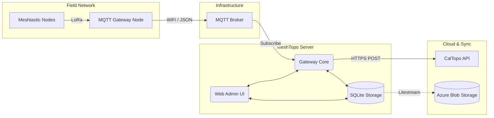

# MeshTopo System Architecture and Design Document

**Version:** 1.1
**Target Audience:** System Integrators, Project Managers, and Technical Leads

---

## 1. Executive Summary

**MeshTopo** is an enterprise-grade, lightweight software gateway engineered to bridge the gap between offline LoRa wireless networks (Meshtastic) and cloud-based mapping platforms (CalTopo). This gateway creates a seamless, real-time data pipeline that transforms low-bandwidth mesh radio packets into high-fidelity geographical position reports.

Designed for edge deployment scenarios, incident response teams, and multi-organizational events, MeshTopo offers robust multi-tenant capabilities, cloud-native persistence, and an intuitive web management interface.

---

## 2. High-Level Architecture

MeshTopo operates as a linear stream-processing and routing engine with a highly decoupled architecture.

### 2.1 The Data Pipeline

The core data flow traverses four operational domains:

1. **The Edge Network (Meshtastic):** Field hardware (LoRa mesh radios) propagates physical coordinates. An egress node structured as an "MQTT Gateway" bridges these RF signals to a local or remote TCP/IP network.
2. **The Message Broker (MQTT):** An intermediary publish-subscribe broker (typically Mosquitto) ingests and organizes JSON telemetry data.
3. **The Gateway Service (MeshTopo):** A Python-based microservice that subscribes to the MQTT broker, validating, filtering, transforming, and routing the positional data according to dynamic administrative configurations.
4. **The C4I Platform (CalTopo):** Command, Control, Communications, Computers, and Intelligence (C4I) mapping service that renders the field assets on real-time organizational maps.

### 2.2 System Components Diagram

---

## 3. Core Capabilities and Subsystems

### 3.1 Gateway Core (Asynchronous Processing)

The Gateway Core is written in Python (using `asyncio`, `aiohttp`, and `asyncio-mqtt`) to handle massive concurrent throughput without thread-blocking.

- **Message Ingestion & Parsing:** Extracts node metadata, position payloads, and timestamp constraints in real-time.
- **Dynamic Node Resolution:** Performs a two-tier resolution to associate transient Node IDs with permanent Hardware IDs, establishing durable object identity.
- **Reporting Engine:** Dispatches RESTful HTTP payloads to the CalTopo API using appropriate geographic transformations and coordinate math.

### 3.2 Multi-Tenant Organization Support

MeshTopo supports massive scaling through **Multi-Tenancy**. A single hardware infrastructure and gateway service can service multiple distinct teams or organizations safely.

- **Tenant Isolation:** Each tenant has an independent operational domain, separate login credentials, and isolated CalTopo connection keys.
- **Routing Rules:** Radios belonging to "Team Alpha" are logically separated and sent exclusively to "Map Alpha", while "Team Bravo" nodes are routed conditionally to "Map Bravo".
- **Global Administrator Privileges:** A super-user layer evaluates unassigned field radios and logically maps them to appropriate tenant configurations.

### 3.3 Data Persistence and High Availability

State, user configurations, and node identity relationships are no longer constrained by ephemeral memory or static YAML files.

- **SQLite Engine:** Persistent, file-based structured storage using `sqlitedict` enables durable saving of tenant details, user session state, and mapping assignments without relying on an external database server.
- **Cloud-Native Replication (Litestream):** For enterprise and continuous-availability deployments (e.g., Azure Container Apps), MeshTopo leverages **Litestream** to continuously stream write-ahead logs (WAL) to Azure Blob Storage (or Amazon S3). This permits zero-loss recovery and true horizontal scalability.

### 3.4 Web Administration UI

System Administrators and Tenant Managers interact with systems through a secure, built-in application interface built with `aiohttp` web server methodologies.

- **Live Monitoring Dashboard:** Real-time metrics across device states, log streaming, and message ingestion ratios.
- **Identity & Security:** Session caching, CSRF projection, bcrypt password hashing, and role-based access control (Admin vs Tenant).
- **Zero-Downtime Reconfiguration:** Mapping rules, tenant generation, and group allocations are performed remotely. The Gateway Core honors configuration diffs gracefully without requiring a hypervisor restart.

---

## 4. Deployment Models

MeshTopo is engineered to operate across varied environmental constraints:

1. **Tactical Edge (Offline / Semi-Connected):** Deployed locally onto a Raspberry Pi alongside an offline CalTopo integration server, surviving completely disconnected from the Internet.
2. **Containerized Standard (Docker Compose):** Packaged with an internal Mosquitto broker and spun up in traditional Linux server environments.
3. **Cloud Native (Azure Container Apps):** A fully managed serverless deployment leveraging Litestream persistence, managed identities, and cloud-scale load balancing.

---

## 5. Security Profile

- **Transport Security:** Interactions between MeshTopo and CalTopo API utilize robust TLS (HTTPS). In full deployments, ingress to the Web UI and MQTT broker is orchestrated by reverse proxies (e.g., Traefik/Caddy) with Let's Encrypt automated certificates.
- **Authentication:** The Web UI relies on cryptographically signed local cookies and robust password derivation techniques (bcrypt). Tenant workspaces are sandboxed mechanically from peer intervention.
- **Least-Privilege Execution:** Container images run natively as non-root daemon users, minimizing breakout vulnerability factors in containerized ecosystems.
