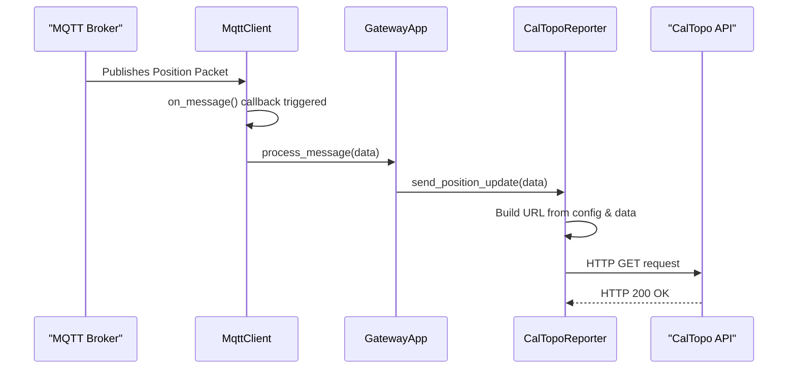

# **Software Design Document: Meshtastic-to-CalTopo Gateway**

-   **Project:** `meshtopo`
-   **Version:** 1.0
-   **Date:** October 9, 2025
-   **Author:** Clayton Auld

---

## 1. Introduction

### 1.1 Purpose

This document provides a detailed technical design for the **meshtopo** gateway. It is intended for software engineers responsible for implementation and project managers seeking to understand the system's architecture, features, and scope.

### 1.2 Problem Statement

Backcountry coordinators, event organizers, and response teams often use a mix of off-grid communication tools like **Meshtastic (LoRa)** and online mapping platforms like **CalTopo**. There is no direct bridge between these two systems, making it difficult to achieve real-time situational awareness of field assets on a shared, high-quality map. This project solves that problem by creating a lightweight, reliable software gateway to forward location data from a Meshtastic network directly to a CalTopo map.

### 1.3 Scope

-   **In-Scope:** The gateway will connect to an MQTT broker, subscribe to Meshtastic position topics, parse the data, and forward it to the CalTopo Position Report API. The application will be configurable, log its status, and be deployable as a Docker container.
-   **Out-of-Scope:** This project will not involve any modification of the Meshtastic firmware. It will not provide a user interface beyond terminal logging. Two-way communication from CalTopo back to Meshtastic is a potential future enhancement but is not part of this version.

### 1.4 License

This project will be licensed under the **GNU Affero General Public License v3 (AGPLv3)**. This is a strong copyleft license chosen to ensure that the source code, including any derivative works or modifications used to provide a network service, remains open and available to the community.

---

## 2. System Architecture

The system operates on a simple, linear data flow model composed of four distinct components.

1. **Meshtastic Network**: A decentralized mesh network of LoRa nodes. At least one node is configured as an "MQTT Gateway," connecting to a local WiFi network to forward all network traffic.
2. **MQTT Broker**: A central message broker (e.g., Mosquitto) that acts as the intermediary. It receives all data from the Meshtastic MQTT Gateway and allows other clients, like our service, to subscribe to this data stream.
3. **Gateway Service (This Project)**: The core application. A Python service that subscribes to the MQTT broker, intelligently filters for position packets, transforms the data, and executes API calls to CalTopo.
4. **CalTopo API**: A cloud-based API endpoint provided by CalTopo that accepts position reports via HTTP GET requests and plots them on a specified map layer.

### 2.5 Enhanced System Architecture with Optional Components

The system can be enhanced with additional optional components to provide a complete, self-contained deployment solution:

1. **Integrated MQTT Broker**: An optional Mosquitto MQTT broker service included in the Docker Compose stack, eliminating the need for external MQTT infrastructure.

2. **SSL/TLS Termination**: An optional Traefik reverse proxy service that provides automatic SSL certificate provisioning and renewal using Let's Encrypt, securing web-based components.

3. **Web Management Interface**: An optional Flask-based web application that provides:

    - Simple username/password authentication
    - Map selection interface for choosing target CalTopo maps
    - RESTful API endpoints for programmatic access
    - Real-time status monitoring and configuration management
    - Per-user CalTopo credentials management

4. **Enhanced Configuration Management**: Centralized configuration via `config.yaml` that controls all optional components, enabling users to customize their deployment based on specific needs.

This enhanced architecture supports three deployment modes:

-   **Minimal**: Core gateway service only (existing functionality)
-   **Standard**: Gateway + integrated MQTT broker
-   **Full**: Gateway + MQTT + SSL + Web UI (complete solution)

---

## 3. Requirements

### 3.1 Functional Requirements (FR)

-   **FR-1**: The system **shall** connect to an MQTT broker using credentials provided in a configuration file.
-   **FR-2**: The system **shall** subscribe to a configurable MQTT topic pattern to capture Meshtastic JSON packets.
-   **FR-3**: The system **shall** parse incoming JSON payloads to extract node ID, latitude, longitude, and timestamp.
-   **FR-4**: The system **shall** maintain a mapping of Meshtastic Node IDs to CalTopo Device IDs, as defined in the configuration file.
-   **FR-5**: The system **shall** construct a valid CalTopo Position Report API URL.
-   **FR-6**: The system **shall** send an HTTP GET request to the constructed URL for each valid position packet received from a mapped node.

### 3.2 Non-Functional Requirements (NFR)

-   **NFR-1**: All operational parameters (MQTT/CalTopo details, node mappings) **shall** be externally configurable via a `config.yaml` file.
-   **NFR-2**: The application **shall** log key events, including successful connections, data processing, and API submissions.
-   **NFR-3**: The application **shall** handle and log common errors gracefully (e.g., MQTT disconnection, API unavailability, malformed data).
-   **NFR-4**: The application **shall** be deployable as a self-contained Docker container.
-   **NFR-5**: The application **shall** be lightweight, with minimal CPU and memory footprint.

---

## 4. Detailed Design

### 4.1 Software Stack

-   **Language**: **Python 3.9+**. Chosen for its rapid development, excellent library support, and suitability for I/O-bound tasks.
-   **Key Libraries**:
    -   `paho-mqtt`: The de facto standard for MQTT communication in Python.
    -   `requests`: Simplifies making HTTP requests to the CalTopo endpoint.
    -   `PyYAML`: For safe and easy loading of the `config.yaml` file.

### 4.2 Class Structure

The application will be built using an object-oriented approach to separate concerns.

-   `**GatewayApp**`: The main class and entry point.
    -   Responsibilities: Orchestrates the application lifecycle. Initializes all other components, starts the MQTT client, and handles graceful shutdown.
-   `**Config**`: A data class to hold validated configuration loaded from `config.yaml`.
-   `**MqttClient**`:
    -   Responsibilities: Manages the entire lifecycle of the MQTT connection, including connecting, subscribing, and handling the `on_message` callback.
-   `**CalTopoReporter**`:
    -   Responsibilities: Contains the logic for interacting with the CalTopo API. It receives parsed position data, looks up the correct Device ID, constructs the API URL, and executes the HTTP GET request.

### 4.3 Sequence Diagram

This diagram shows the process for handling a single position packet.



### 4.4 Web UI Architecture

The optional web management interface is built using Flask and provides a modern, secure way to configure and monitor the Meshtopo gateway service.

#### 4.4.1 Application Structure

The web UI follows a modular Flask application structure:

```
src/web_ui/
├── __init__.py          # Flask app factory
├── app.py              # Main application entry point
├── routes/
│   ├── __init__.py
│   ├── auth.py         # Simple authentication routes
│   ├── maps.py         # Map selection and management
│   └── api.py          # RESTful API endpoints
├── models/
│   ├── __init__.py
│   ├── user.py         # User session management
│   └── config.py       # Configuration state management
├── services/
│   ├── __init__.py
│   └── caltopo_api.py  # CalTopo Team API integration
├── templates/
│   ├── base.html       # Base template
│   ├── login.html      # Simple login page
│   ├── maps.html       # Map selection interface
│   └── status.html     # Service status dashboard
└── utils/
    └── password.py     # Password hashing utilities
```

#### 4.4.2 Simple Authentication System

The web UI implements a simple username/password authentication system:

1. **User Login**: Users enter username and password on the login form
2. **Password Verification**: System verifies password against bcrypt hash stored in configuration
3. **Session Creation**: Upon successful authentication, a secure session is created
4. **Session Management**: Sessions are managed with configurable timeout and security settings
5. **Role-Based Access**: Users have assigned roles (admin/user) with different permissions

**Authentication Features:**

-   bcrypt password hashing with salt
-   Secure session management
-   Role-based access control (admin/user)
-   Per-user CalTopo credentials
-   Configurable session timeout
-   Remember me functionality

#### 4.4.3 CalTopo Integration Architecture

The web UI integrates with CalTopo using per-user service account credentials:

1. **User Authentication**: Simple username/password authentication for web UI access
2. **Per-User CalTopo Credentials**: Each user can have their own CalTopo service account credentials
3. **Map Access Control**: Users can be restricted to specific CalTopo maps
4. **Credential Management**: CalTopo credentials are stored securely in user configuration

**CalTopo Team API Integration:**

-   Service account authentication using credential ID and secret key
-   Per-user credential management
-   Map listing and retrieval via CalTopo Team API endpoints
-   Map selection and configuration updates
-   Real-time map status monitoring
-   Access control based on user permissions

#### 4.4.4 RESTful API Design

The web UI exposes RESTful API endpoints for programmatic access:

**Authentication Endpoints:**

-   `POST /auth/login` - User login with username/password
-   `POST /auth/logout` - Terminate user session
-   `GET /auth/status` - Check authentication status
-   `GET /auth/user` - Get current user information

**Map Management Endpoints:**

-   `GET /maps/list` - Retrieve available CalTopo maps
-   `GET /maps/current` - Get currently selected map
-   `POST /maps/select` - Select target map for position forwarding
-   `GET /maps/{map_id}/status` - Get map-specific status

**Configuration Endpoints:**

-   `GET /api/config` - Retrieve current configuration
-   `POST /api/config/update` - Update configuration parameters
-   `GET /api/config/validate` - Validate configuration settings

**Monitoring Endpoints:**

-   `GET /api/status` - Overall service status
-   `GET /api/metrics` - Performance metrics and statistics
-   `GET /api/logs` - Recent log entries
-   `GET /api/health` - Health check endpoint

#### 4.4.5 Security Considerations

The web UI implements several security measures:

1. **Password Security**: bcrypt password hashing with salt for secure password storage
2. **Session Security**: Secure session management with configurable secret keys and timeouts
3. **CSRF Protection**: Cross-site request forgery protection for all forms
4. **Input Validation**: Comprehensive input validation and sanitization
5. **Rate Limiting**: API rate limiting to prevent abuse, especially for login attempts
6. **HTTPS Enforcement**: Automatic HTTPS redirection when SSL is enabled
7. **Secure Headers**: Security headers for XSS and clickjacking protection
8. **Role-Based Access**: Admin and user roles with different permission levels
9. **Credential Isolation**: Per-user CalTopo credentials for access control

---

## 5. Data Models & Interfaces

### 5.1 Input: Meshtastic MQTT JSON

The gateway will process JSON objects from the `msh/.../json/position/#` topic. It will primarily extract `fromId` and the `payload` object.

```json
{
    "fromId": "!823a4edc",
    "type": "position",
    "payload": {
        "latitude_i": 612188460,
        "longitude_i": -1499001320
    }
}
```

_Note: `latitude_i` and `longitude_i` must be divided by `1e7` to get decimal degrees._

### 5.2 API Interface: CalTopo Position Report

The service will make an HTTP GET request to the following endpoint.

-   **Method**: `GET`
-   **Endpoint**: `https://caltopo.com/api/v1/position/report/{GROUP}`
-   **Query Parameters**:
    -   `id`: The `{DEVICE ID}` of the node.
    -   `lat`: Latitude in decimal degrees.
    -   `lng`: Longitude in decimal degrees.
-   **Example URL**: `https://caltopo.com/api/v1/position/report/MESH-TEAM-ALPHA?id=TEAM-LEAD&lat=61.2188460&lng=-149.9001320`

---

## 6. Configuration Management

The system is configured via a single `config.yaml` file that supports both minimal and enhanced deployment modes. All optional components can be enabled or disabled through configuration settings.

### 6.1 Core Configuration

```yaml
# config.yaml

# Configuration for the MQTT Broker connection
mqtt:
    use_internal_broker: true # Use integrated Mosquitto broker
    broker: "mosquitto" # Broker hostname (internal service name when use_internal_broker: true)
    port: 1883 # MQTT broker port
    username: "your_mqtt_user"
    password: "your_mqtt_password"
    topic: "msh/+/+/json/position/#"

# Configuration for the CalTopo API
caltopo:
    group: "MESH-TEAM-ALPHA"
    map_id: "" # Selected map ID (set via web UI)

    # CalTopo Team API configuration (for map selection feature)
    team_api:
        enabled: false # Enable Team API integration
        credential_id: "" # CalTopo service account credential ID
        secret_key: "" # CalTopo service account secret key

# User accounts for web UI authentication
# Generate password hashes using: python -c "import bcrypt; print(bcrypt.hashpw('your_password'.encode(), bcrypt.gensalt()).decode())"
users:
    - username: "admin"
      password_hash: "$2b$12$..." # Replace with actual bcrypt hash
      role: "admin"
      caltopo_credentials:
          credential_id: "ABC123DEF456"
          secret_key: "base64_encoded_secret"
          accessible_maps: ["map-id-1", "map-id-2"]

    - username: "user1"
      password_hash: "$2b$12$..." # Replace with actual bcrypt hash
      role: "user"
      caltopo_credentials:
          credential_id: "XYZ789GHI012"
          secret_key: "base64_encoded_secret"
          accessible_maps: ["map-id-3"]

# Mapping of Meshtastic hardware IDs to CalTopo device IDs
nodes:
    "!823a4edc":
        device_id: "TEAM-LEAD"
    "!a4b8c2f0":
        device_id: "COMMS"
```

### 6.2 SSL/TLS Configuration

```yaml
# SSL/TLS configuration for automatic certificate provisioning
ssl:
    enabled: false # Master toggle for SSL features
    email: "admin@example.com" # Email for Let's Encrypt notifications
    domain: "meshtopo.example.com" # Primary domain
    acme_challenge: "http" # Challenge type: "http" or "dns"

    # Per-service SSL configuration
    services:
        web_ui:
            enabled: true
            subdomain: "meshtopo" # Subdomain for web UI
        mqtt:
            enabled: false # MQTT over TLS (optional)
            port: 8883
```

### 6.3 Web UI Configuration

```yaml
# Web management interface configuration
web_ui:
    enabled: false # Master toggle for web UI
    host: "0.0.0.0" # Bind address
    port: 8080 # Bind port
    secret_key: "" # Flask session secret (generate random string)

    # Session configuration
    session:
        timeout: 3600 # Session timeout in seconds
        secure: true # Secure cookies (HTTPS only)
        httponly: true # HTTP-only cookies

    # Rate limiting
    rate_limit:
        enabled: true
        requests_per_minute: 60
```

### 6.4 Logging Configuration

```yaml
# Logging configuration
logging:
    level: "INFO" # DEBUG, INFO, WARN, ERROR
    format: "%(asctime)s - %(name)s - %(levelname)s - %(message)s"

    # File logging (optional)
    file:
        enabled: false
        path: "/app/logs/meshtopo.log"
        max_size: "10MB"
        backup_count: 5

    # Web UI specific logging
    web_ui:
        level: "INFO"
        access_log: true
```

### 6.5 Deployment Mode Configuration

The configuration file supports three deployment modes:

**Minimal Mode** (Core functionality only):

```yaml
mqtt:
    use_internal_broker: false
    broker: "192.168.1.100" # External broker
ssl:
    enabled: false
web_ui:
    enabled: false
```

**Standard Mode** (Core + Integrated MQTT):

```yaml
mqtt:
    use_internal_broker: true
ssl:
    enabled: false
web_ui:
    enabled: false
```

**Full Mode** (All features enabled):

```yaml
mqtt:
    use_internal_broker: true
ssl:
    enabled: true
web_ui:
    enabled: true
caltopo:
    team_api:
        enabled: true
```

---

## 7. Error Handling & Logging

| Scenario                    | Trigger                                       | Action                                                  | Log Level |
| --------------------------- | --------------------------------------------- | ------------------------------------------------------- | --------- |
| **MQTT Disconnection**      | Network loss, broker restart                  | Attempt to reconnect with exponential backoff.          | `WARN`    |
| **Invalid JSON**            | Corrupted message from MQTT broker            | Discard the message and log the payload for debugging.  | `WARN`    |
| **Unmapped Node ID**        | Position packet received from an unknown node | Discard the message. (Log as `DEBUG` to avoid spam).    | `DEBUG`   |
| **CalTopo API Unreachable** | No internet, DNS failure, CalTopo is down     | Log the error and the failed URL, then drop the packet. | `ERROR`   |
| **CalTopo API Error**       | HTTP 4xx or 5xx response from CalTopo         | Log the error, status code, and response body.          | `ERROR`   |
| **Successful Post**         | HTTP 200 OK from CalTopo                      | Log the node ID and successful submission.              | `INFO`    |

---

## 8. Deployment

The recommended deployment method is via Docker Compose for process isolation, dependency management, and easy scaling. The system supports multiple deployment modes from minimal to full-featured.

### 8.1 Dockerfile

The core gateway service uses a lightweight Python container:

```dockerfile
FROM python:3.9-slim

# Set working directory
WORKDIR /app

# Install system dependencies
RUN apt-get update && apt-get install -y --no-install-recommends \
    gcc=4:14.2.0-1 \
    && rm -rf /var/lib/apt/lists/*

# Copy requirements first for better caching
COPY requirements.txt .

# Install Python dependencies
RUN pip install --no-cache-dir -r requirements.txt

# Copy application code
COPY . .

# Create non-root user for security
RUN useradd --create-home --shell /bin/bash meshtopo && \
    chown -R meshtopo:meshtopo /app

# Switch to non-root user
USER meshtopo

# Expose port (if needed for health checks in the future)
EXPOSE 8080

# Health check
HEALTHCHECK --interval=30s --timeout=10s --start-period=5s --retries=3 \
    CMD python -c "import requests; requests.get('https://caltopo.com/api/v1/position/report/test', timeout=5)" || exit 1

# Set environment variables
ENV PYTHONUNBUFFERED=1
ENV PYTHONDONTWRITEBYTECODE=1

# Default command
CMD ["python", "src/gateway.py"]
```

### 8.2 Docker Compose Architecture

The complete Docker Compose stack includes all optional components with conditional service startup based on configuration:

```yaml
networks:
    meshtopo:
        driver: bridge

volumes:
    mosquitto_data:
    traefik_certs:
    traefik_logs:

services:
    # Traefik reverse proxy with SSL termination (conditional)
    traefik:
        image: traefik:v2.10
        container_name: traefik
        restart: unless-stopped
        command:
            - --api.dashboard=true
            - --api.insecure=false
            - --providers.docker=true
            - --providers.docker.exposedbydefault=false
            - --entrypoints.web.address=:80
            - --entrypoints.websecure.address=:443
            - --certificatesresolvers.letsencrypt.acme.httpchallenge=true
            - --certificatesresolvers.letsencrypt.acme.httpchallenge.entrypoint=web
            - --certificatesresolvers.letsencrypt.acme.email=${SSL_EMAIL}
            - --certificatesresolvers.letsencrypt.acme.storage=/certs/acme.json
            - --log.level=INFO
            - --accesslog=true
        ports:
            - "80:80"
            - "443:443"
        volumes:
            - /var/run/docker.sock:/var/run/docker.sock:ro
            - traefik_certs:/certs
            - traefik_logs:/logs
        networks:
            - meshtopo
        profiles:
            - ssl

    # Mosquitto MQTT broker (conditional)
    mosquitto:
        image: eclipse-mosquitto:2.0
        container_name: mosquitto
        restart: unless-stopped
        ports:
            - "1883:1883"
            - "9001:9001"
        volumes:
            - mosquitto_data:/mosquitto/data
            - mosquitto_data:/mosquitto/log
            - ./deploy/mosquitto.conf:/mosquitto/config/mosquitto.conf:ro
        networks:
            - meshtopo
        profiles:
            - mqtt

    # Core Meshtopo gateway service
    meshtopo-gateway:
        build: .
        container_name: meshtopo-gateway
        restart: unless-stopped
        volumes:
            - ./config/config.yaml:/app/config/config.yaml:ro
            - ./logs:/app/logs
        environment:
            - TZ=UTC
        deploy:
            resources:
                limits:
                    memory: 128M
                    cpus: "0.5"
                reservations:
                    memory: 64M
                    cpus: "0.1"
        healthcheck:
            test: ["CMD", "python", "-c", "import requests; requests.get('https://caltopo.com/api/v1/position/report/test', timeout=5)"]
            interval: 30s
            timeout: 10s
            retries: 3
            start_period: 10s
        logging:
            driver: "json-file"
            options:
                max-size: "10m"
                max-file: "3"
        networks:
            - meshtopo
        depends_on:
            - mosquitto
        profiles:
            - core

    # Web management interface (conditional)
    meshtopo-web:
        build:
            context: .
            dockerfile: Dockerfile.web
        container_name: meshtopo-web
        restart: unless-stopped
        volumes:
            - ./config/config.yaml:/app/config/config.yaml:ro
            - ./logs:/app/logs
        environment:
            - TZ=UTC
            - FLASK_ENV=production
        deploy:
            resources:
                limits:
                    memory: 256M
                    cpus: "0.5"
                reservations:
                    memory: 128M
                    cpus: "0.1"
        healthcheck:
            test: ["CMD", "curl", "-f", "http://localhost:8080/health"]
            interval: 30s
            timeout: 10s
            retries: 3
            start_period: 10s
        logging:
            driver: "json-file"
            options:
                max-size: "10m"
                max-file: "3"
        networks:
            - meshtopo
        depends_on:
            - meshtopo-gateway
        profiles:
            - web
        labels:
            - "traefik.enable=true"
            - "traefik.http.routers.meshtopo-web.rule=Host(`${SSL_DOMAIN}`)"
            - "traefik.http.routers.meshtopo-web.entrypoints=websecure"
            - "traefik.http.routers.meshtopo-web.tls.certresolver=letsencrypt"
            - "traefik.http.services.meshtopo-web.loadbalancer.server.port=8080"
```

### 8.3 SSL/TLS Configuration with Traefik

Traefik provides automatic SSL certificate provisioning and renewal using Let's Encrypt. The configuration supports both HTTP and DNS challenges.

#### 8.3.1 Environment Variables

Create a `.env` file for SSL configuration:

```bash
# SSL Configuration
SSL_EMAIL=admin@example.com
SSL_DOMAIN=meshtopo.example.com

# Optional: DNS provider credentials for DNS challenge
# DNS_PROVIDER=cloudflare
# DNS_EMAIL=admin@example.com
# DNS_API_TOKEN=your_api_token
```

#### 8.3.2 Traefik Configuration

Traefik is configured via command-line arguments in the Docker Compose file:

-   **HTTP Challenge**: Uses port 80 for domain validation
-   **DNS Challenge**: Uses DNS provider API for validation (supports Cloudflare, Route53, etc.)
-   **Certificate Storage**: Persistent volume for certificate storage
-   **Dashboard**: Optional web dashboard for monitoring

#### 8.3.3 Service Labels

Services are automatically configured for SSL using Docker labels:

```yaml
labels:
    - "traefik.enable=true"
    - "traefik.http.routers.service-name.rule=Host(`subdomain.example.com`)"
    - "traefik.http.routers.service-name.entrypoints=websecure"
    - "traefik.http.routers.service-name.tls.certresolver=letsencrypt"
```

### 8.4 Deployment Profiles

Docker Compose profiles allow selective service startup:

**Minimal Deployment** (Core gateway only):

```bash
docker-compose --profile core up -d
```

**Standard Deployment** (Core + MQTT):

```bash
docker-compose --profile core --profile mqtt up -d
```

**Full Deployment** (All features):

```bash
docker-compose --profile core --profile mqtt --profile web --profile ssl up -d
```

### 8.5 Mosquitto Configuration

The integrated Mosquitto broker uses a custom configuration file:

```conf
# mosquitto.conf
listener 1883
allow_anonymous false
password_file /mosquitto/config/passwd

# WebSocket support
listener 9001
protocol websockets

# Persistence
persistence true
persistence_location /mosquitto/data/

# Logging
log_dest file /mosquitto/log/mosquitto.log
log_type error
log_type warning
log_type notice
log_type information
```

### 8.6 Quick Start Commands

**1. Clone and configure:**

```bash
git clone https://github.com/clayauld/meshtopo.git
cd meshtopo
cp config/config.yaml.example config/config.yaml
# Edit config/config.yaml with your settings
```

**2. Start services:**

```bash
# Minimal mode
docker-compose --profile core up -d

# Full mode with SSL
docker-compose --profile core --profile mqtt --profile web --profile ssl up -d
```

**3. View logs:**

```bash
docker-compose logs -f
```

**4. Access web interface:**

```bash
# HTTP (if SSL disabled)
http://localhost:8080

# HTTPS (if SSL enabled)
https://meshtopo.example.com
```

---

## 9. Future Enhancements

The following enhancements are planned for future releases:

### 9.1 Implemented Features (Moved from Future)

The following features have been implemented in the enhanced architecture:

-   **Map Selection UI**: Web-based interface for selecting CalTopo maps with simple authentication
-   **API Endpoints**: RESTful API for programmatic access to map management and configuration
-   **Integrated MQTT Broker**: Optional Mosquitto broker included in Docker Compose stack
-   **SSL/TLS Support**: Automatic SSL certificate provisioning with Traefik and Let's Encrypt
-   **Enhanced Configuration**: Comprehensive configuration management for all optional components
-   **User Management**: Simple username/password authentication with role-based access control
-   **Per-User CalTopo Integration**: Individual CalTopo credentials for each user

### 9.2 Planned (Potential) Enhancements

-   **Two-Way Messaging**: Implement a mechanism to send short text messages back to the Meshtastic network from CalTopo.
-   **Status Reporting**: Forward additional Meshtastic telemetry (e.g., battery level, signal strength) to CalTopo.
-   **Advanced Analytics**: Position history tracking, movement patterns, and performance analytics.
-   **Multiple CalTopo Group Support**: Support for multiple CalTopo groups and dynamic group switching.
-   **Mobile App**: Native mobile application for field operators to monitor and configure the system.
-   **Advanced Security**: Multi-factor authentication, role-based access control, and audit logging.
-   **High Availability**: Clustering support, load balancing, and automatic failover capabilities.
-   **Custom Integrations**: Plugin system for integrating with other mapping platforms and communication systems.

### 9.3 API Endpoint Details

The web UI provides comprehensive RESTful API endpoints for external integration:

#### 9.3.1 Authentication API

-   `POST /auth/login` - User login with username/password
-   `POST /auth/logout` - Terminate user session
-   `GET /auth/status` - Check current authentication status
-   `GET /auth/user` - Get current user information

#### 9.3.2 Map Management API

-   `GET /maps/list` - Retrieve all available CalTopo maps
-   `GET /maps/current` - Get currently selected map configuration
-   `POST /maps/select` - Select target map for position forwarding
-   `GET /maps/{map_id}` - Get detailed information about specific map
-   `GET /maps/{map_id}/status` - Get real-time status of map integration
-   `POST /maps/{map_id}/test` - Test connection to specific map

#### 9.3.3 Configuration API

-   `GET /api/config` - Retrieve current system configuration
-   `POST /api/config/update` - Update configuration parameters
-   `GET /api/config/validate` - Validate configuration settings
-   `POST /api/config/reset` - Reset configuration to defaults
-   `GET /api/config/backup` - Export configuration as backup
-   `POST /api/config/restore` - Restore configuration from backup

#### 9.3.4 Monitoring API

-   `GET /api/status` - Overall system status and health
-   `GET /api/metrics` - Performance metrics and statistics
-   `GET /api/logs` - Recent log entries with filtering
-   `GET /api/health` - Detailed health check information
-   `GET /api/nodes` - Status of all configured Meshtastic nodes
-   `GET /api/nodes/{node_id}/history` - Position history for specific node

#### 9.3.5 System Management API

-   `POST /api/system/restart` - Restart gateway service
-   `POST /api/system/reload` - Reload configuration without restart
-   `GET /api/system/info` - System information and version details
-   `GET /api/system/resources` - Resource usage statistics
-   `POST /api/system/backup` - Create system backup
-   `POST /api/system/update` - Update system components

### 9.4 Integration Examples

The API endpoints enable various integration scenarios:

**Automation Scripts:**

```bash
# Login and get session token
curl -X POST https://meshtopo.example.com/auth/login \
  -H "Content-Type: application/x-www-form-urlencoded" \
  -d "username=admin&password=your_password"

# Select map via API (requires authentication)
curl -X POST https://meshtopo.example.com/maps/select \
  -H "Cookie: session=your_session_cookie" \
  -d "map_id=team-alpha-map-123"

# Get system status
curl https://meshtopo.example.com/api/status
```

**Monitoring Integration:**

```bash
# Health check for monitoring systems
curl -f https://meshtopo.example.com/api/health || alert "Meshtopo down"

# Metrics collection
curl https://meshtopo.example.com/api/metrics | jq '.position_updates_per_minute'
```

**Configuration Management:**

```bash
# Backup configuration
curl https://meshtopo.example.com/api/config/backup > config-backup.yaml

# Update node mappings
curl -X POST https://meshtopo.example.com/api/config/update \
  -H "Content-Type: application/json" \
  -d @updated-nodes.json
```
