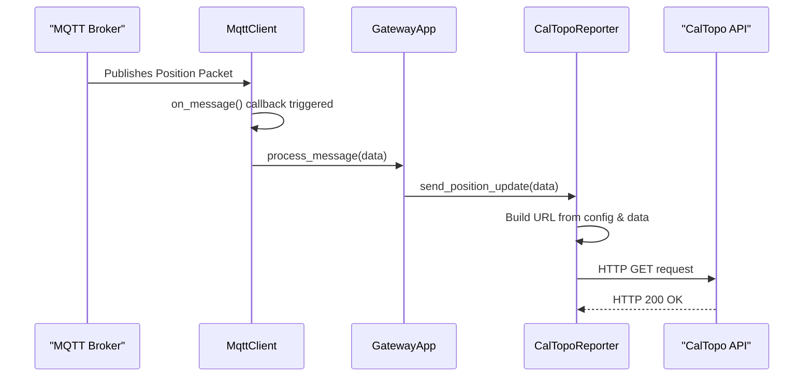

# **Software Design Document: Meshtastic-to-CalTopo Gateway**

- **Project:** `meshtopo`
- **Version:** 1.0
- **Date:** October 9, 2025
- **Author:** Clayton Auld

---

## 1. Introduction

### 1.1 Purpose

This document provides a detailed technical design for the **meshtopo** gateway. It is intended for software engineers responsible for implementation and project managers seeking to understand the system's architecture, features, and scope.

### 1.2 Problem Statement

Backcountry coordinators, event organizers, and response teams often use a mix of off-grid communication tools like **Meshtastic (LoRa)** and online mapping platforms like **CalTopo**. There is no direct bridge between these two systems, making it difficult to achieve real-time situational awareness of field assets on a shared, high-quality map. This project solves that problem by creating a lightweight, reliable software gateway to forward location data from a Meshtastic network directly to a CalTopo map.

### 1.3 Scope

- **In-Scope:** The gateway will connect to an MQTT broker, subscribe to Meshtastic position topics, parse the data, and forward it to the CalTopo Position Report API. The application will be configurable, log its status, and be deployable as a Docker container.
- **Out-of-Scope:** This project will not involve any modification of the Meshtastic firmware. It will not provide a user interface beyond terminal logging. Two-way communication from CalTopo back to Meshtastic is a potential future enhancement but is not part of this version.

### 1.4 License

This project will be licensed under the **GNU Affero General Public License v3 (AGPLv3)**. This is a strong copyleft license chosen to ensure that the source code, including any derivative works or modifications used to provide a network service, remains open and available to the community.

---

## 2. System Architecture

The system operates on a simple, linear data flow model composed of four distinct components.

1. **Meshtastic Network**: A decentralized mesh network of LoRa nodes. At least one node is configured as an "MQTT Gateway," connecting to a local WiFi network to forward all network traffic.
2. **MQTT Broker**: A central message broker (e.g., Mosquitto) that acts as the intermediary. It receives all data from the Meshtastic MQTT Gateway and allows other clients, like our service, to subscribe to this data stream.
3. **Gateway Service (This Project)**: The core application. A Python service that subscribes to the MQTT broker, intelligently filters for position packets, transforms the data, and executes API calls to CalTopo.
4. **CalTopo API**: A cloud-based API endpoint provided by CalTopo that accepts position reports via HTTP GET requests and plots them on a specified map layer.

### 2.5 Enhanced System Architecture with Optional Components

The system can be enhanced with additional optional components to provide a complete, self-contained deployment solution:

1. **Integrated MQTT Broker**: An optional Mosquitto MQTT broker service included in the Docker Compose stack, eliminating the need for external MQTT infrastructure.

2. **SSL/TLS Termination**: An optional Traefik reverse proxy service that provides automatic SSL certificate provisioning and renewal using Let's Encrypt, securing web-based components.

3. **Enhanced Configuration Management**: Centralized configuration via `config.yaml` that controls all optional components, enabling users to customize their deployment based on specific needs.

This enhanced architecture supports three deployment modes:

- **Minimal**: Core gateway service only (existing functionality)
- **Standard**: Gateway + integrated MQTT broker
- **Full**: Gateway + MQTT + SSL (complete solution)

---

## 3. Requirements

### 3.1 Functional Requirements (FR)

- **FR-1**: The system **shall** connect to an MQTT broker using credentials provided in a configuration file.
- **FR-2**: The system **shall** subscribe to a configurable MQTT topic pattern to capture Meshtastic JSON packets.
- **FR-3**: The system **shall** parse incoming JSON payloads to extract node ID, latitude, longitude, and timestamp.
- **FR-4**: The system **shall** maintain a mapping of Meshtastic Node IDs to CalTopo callsigns, as defined in the configuration file. The system **shall** support automatic callsign discovery using Meshtastic longname/shortname fields as fallback when explicit mappings are not available. The system **shall** support configurable control over unknown device behavior (allow/block position updates).
- **FR-5**: The system **shall** construct a valid CalTopo Position Report API URL using either Team Account connect_key or GROUP-based authentication methods.
- **FR-6**: The system **shall** send an HTTP GET request to the constructed URL for each valid position packet received from a mapped node.

### 3.2 Non-Functional Requirements (NFR)

- **NFR-1**: All operational parameters (MQTT/CalTopo details, node mappings) **shall** be externally configurable via a `config.yaml` file.
- **NFR-2**: The application **shall** log key events, including successful connections, data processing, and API submissions.
- **NFR-3**: The application **shall** handle and log common errors gracefully (e.g., MQTT disconnection, API unavailability, malformed data).
- **NFR-4**: The application **shall** be deployable as a self-contained Docker container.
- **NFR-5**: The application **shall** be lightweight, with minimal CPU and memory footprint.

---

## 4. Detailed Design

### 4.1 Software Stack

- **Language**: **Python 3.9+**. Chosen for its rapid development, excellent library support, and suitability for I/O-bound tasks.
- **Key Libraries**:
  - `paho-mqtt`: The de facto standard for MQTT communication in Python.
  - `requests`: Simplifies making HTTP requests to the CalTopo endpoint.
  - `PyYAML`: For safe and easy loading of the `config.yaml` file.

### 4.2 Class Structure

The application will be built using an object-oriented approach to separate concerns.

- `**GatewayApp**`: The main class and entry point.
  - Responsibilities: Orchestrates the application lifecycle. Initializes all other components, starts the MQTT client, and handles graceful shutdown.
- `**Config**`: A data class to hold validated configuration loaded from `config.yaml`.
- `**MqttClient**`:
  - Responsibilities: Manages the entire lifecycle of the MQTT connection, including connecting, subscribing, and handling the `on_message` callback.
- `**CalTopoReporter**`:
  - Responsibilities: Contains the logic for interacting with the CalTopo API. It receives parsed position data, looks up the correct Device ID, constructs the API URL using either connect_key or GROUP-based authentication, and executes the HTTP GET request. Supports both Team Account and custom integration API modes.

### 4.3 Sequence Diagram

This diagram shows the process for handling a single position packet.



### 4.4 Internal MQTT Broker Architecture

The optional internal MQTT broker provides a complete, self-contained MQTT infrastructure using Mosquitto.

#### 4.4.1 Broker Configuration

The internal broker is configured through the `mqtt_broker` section in `config.yaml`:

- **Dynamic Configuration**: Mosquitto configuration files are generated from `config.yaml` settings
- **User Management**: MQTT users defined in configuration with automatic password file generation
- **Security**: No anonymous access by default, with optional ACL support
- **Persistence**: Configurable message persistence and logging
- **WebSocket Support**: Built-in WebSocket support for web clients

#### 4.4.2 Configuration Generation

The system automatically generates Mosquitto configuration files:

1. **mosquitto.conf**: Generated from template with user-defined settings
2. **passwd**: MQTT user password file with hashed passwords
3. **aclfile**: Optional access control list for fine-grained permissions

#### 4.4.3 Docker Integration

The internal broker integrates seamlessly with Docker Compose:

- **Service Definition**: Mosquitto service defined in docker-compose.yml
- **Volume Mounts**: Generated configuration files mounted into container
- **Health Checks**: Built-in health monitoring and connectivity testing
- **Networking**: Automatic network configuration for service communication

---

## 5. Data Models & Interfaces

### 5.1 Input: Meshtastic MQTT JSON

The gateway will process JSON objects from the `msh/REGION/2/json/+/+` topic. It will primarily extract `from` and the `payload` object.

**Note**: Replace `REGION` with the appropriate LoRa region code for your country. See the [Meshtastic LoRa Region by Country documentation](https://meshtastic.org/docs/configuration/region-by-country/) for the correct region code. Common region codes include:

- `US` - United States
- `EU_868` - European Union (868 MHz)
- `ANZ` - Australia/New Zealand
- `CN` - China
- `JP` - Japan

### 5.1.1 Node ID Mapping Mechanism

The gateway uses a two-tier mapping system to handle different types of Meshtastic messages:

#### Primary Mapping (Nodeinfo Messages)

When `nodeinfo` messages are received, the gateway builds a mapping from numeric node IDs to hardware IDs:

```json
{
    "from": 862485920,
    "type": "nodeinfo",
    "payload": {
        "id": "!33687da0",
        "longname": "TEST-DEVICE",
        "shortname": "TEST"
    }
}
```

This creates the mapping: `862485920` → `!33687da0`

#### Fallback Mapping (Position Messages)

When position messages arrive before nodeinfo messages, the gateway uses the `sender` field as a fallback:

```json
{
    "from": 862485920,
    "sender": "!33687da0",
    "type": "position",
    "payload": {
        "latitude_i": 612188460,
        "longitude_i": -1499001320
    }
}
```

The gateway automatically maps `862485920` → `!33687da0` using the `sender` field, ensuring position updates are never missed due to missing nodeinfo messages.

#### Configuration Mapping

The final step maps hardware IDs to CalTopo device names using the configuration:

```yaml
nodes:
    "!33687da0":
        device_id: "TEST-DEVICE"
```

This creates the complete mapping chain: `862485920` → `!33687da0` → `TEST-DEVICE`

_Note: `latitude_i` and `longitude_i` must be divided by `1e7` to get decimal degrees._

### 5.2 API Interface: CalTopo Position Report

The service will make an HTTP GET request to the following endpoint.

- **Method**: `GET`
- **Endpoint**: `https://caltopo.com/api/v1/position/report/{CONNECT_KEY}`
- **Query Parameters**:
  - `id`: The callsign of the device (from Meshtastic longname or config mapping).
  - `lat`: Latitude in decimal degrees.
  - `lng`: Longitude in decimal degrees.
- **Example URL**: `https://caltopo.com/api/v1/position/report/aoJpFiwnxxgGEuaMY6W0gcqdeQ3T2bjoQfzvWbduT9LjJ?id=TEAM-LEAD&lat=61.2188460&lng=-149.9001320`

---

## 6. Configuration Management

The system is configured via a single `config.yaml` file that supports both minimal and enhanced deployment modes. All optional components can be enabled or disabled through configuration settings.

### 6.1 Core Configuration

```yaml
# config.yaml

# Configuration for the MQTT Broker connection
mqtt:
    broker: "localhost" # Broker hostname
    port: 1883 # MQTT broker port
    username: "your_mqtt_user"
    password: "your_mqtt_password"
    topic: "msh/US/2/json/+/+"
    use_internal_broker: false # Use integrated Mosquitto broker

# Configuration for the CalTopo API
caltopo:
    connect_key: "aoJpFiwnxxgGEuaMY6W0gcqdeQ3T2bjoQfzvWbduT9LjJ" # From CalTopo Team Account access URL

# Optional: Node display name overrides
# If not specified, devices will use their Meshtastic longname as callsign
nodes:
    "!823a4edc":
        device_id: "TEAM-LEAD"
    "!a4b8c2f0":
        device_id: "COMMS"

# Internal MQTT Broker Configuration (optional)
mqtt_broker:
    enabled: false # Enable internal Mosquitto broker
    port: 1883 # MQTT broker port
    websocket_port: 9001 # WebSocket port for web clients
    persistence: true # Enable message persistence
    max_connections: 1000 # Maximum concurrent connections
    allow_anonymous: false # Allow anonymous connections
    users:
        - username: "meshtopo"
          password: "secure_password"
          acl: "readwrite" # Access level: read, write, readwrite
        - username: "readonly"
          password: "readonly_pass"
          acl: "read" # Read-only access
    acl_enabled: false # Enable Access Control Lists

# Logging configuration
logging:
    level: INFO
    file:
        enabled: true
        path: logs/meshtopo.log
        max_size: 10MB
        backup_count: 5
```

### 6.2 SSL/TLS Configuration

```yaml
# SSL/TLS configuration for automatic certificate provisioning
ssl:
    enabled: false # Master toggle for SSL features
    email: "admin@example.com" # Email for Let's Encrypt notifications
    domain: "meshtopo.example.com" # Primary domain
    acme_challenge: "http" # Challenge type: "http" or "dns"

    # Per-service SSL configuration
    services:
        mqtt:
            enabled: false # MQTT over TLS (optional)
            port: 8883
```

### 6.3 Internal MQTT Broker Configuration

```yaml
# Internal MQTT Broker Configuration
mqtt_broker:
    enabled: true # Enable internal Mosquitto broker
    port: 1883 # MQTT broker port
    websocket_port: 9001 # WebSocket port for web clients
    persistence: true # Enable message persistence
    max_connections: 1000 # Maximum concurrent connections
    allow_anonymous: false # Allow anonymous connections
    users:
        - username: "meshtopo"
          password: "secure_password"
          acl: "readwrite" # Access level: read, write, readwrite
        - username: "readonly"
          password: "readonly_pass"
          acl: "read" # Read-only access
    acl_enabled: false # Enable Access Control Lists
```

### 6.4 Logging Configuration

```yaml
# Logging configuration
logging:
    level: "INFO" # DEBUG, INFO, WARN, ERROR
    format: "%(asctime)s - %(name)s - %(levelname)s - %(message)s"

    # File logging (optional)
    file:
        enabled: false
        path: "/app/logs/meshtopo.log"
        max_size: "10MB"
        backup_count: 5
```

### 6.5 Deployment Mode Configuration

The configuration file supports three deployment modes:

**Minimal Mode** (Core functionality only):

```yaml
mqtt:
    broker: "192.168.1.100" # External broker
    use_internal_broker: false
mqtt_broker:
    enabled: false
ssl:
    enabled: false
```

**Standard Mode** (Core + Integrated MQTT):

```yaml
mqtt:
    broker: "mosquitto" # Internal broker
    use_internal_broker: true
mqtt_broker:
    enabled: true
ssl:
    enabled: false
```

**Full Mode** (All features enabled):

```yaml
mqtt:
    broker: "mosquitto" # Internal broker
    use_internal_broker: true
mqtt_broker:
    enabled: true
ssl:
    enabled: true
```

---

## 7. Error Handling & Logging

| Scenario                    | Trigger                                       | Action                                                  | Log Level |
| --------------------------- | --------------------------------------------- | ------------------------------------------------------- | --------- |
| **MQTT Disconnection**      | Network loss, broker restart                  | Attempt to reconnect with exponential backoff.          | `WARN`    |
| **Invalid JSON**            | Corrupted message from MQTT broker            | Discard the message and log the payload for debugging.  | `WARN`    |
| **Unmapped Node ID**        | Position packet received from an unknown node | Discard the message. (Log as `DEBUG` to avoid spam).    | `DEBUG`   |
| **CalTopo API Unreachable** | No internet, DNS failure, CalTopo is down     | Log the error and the failed URL, then drop the packet. | `ERROR`   |
| **CalTopo API Error**       | HTTP 4xx or 5xx response from CalTopo         | Log the error, status code, and response body.          | `ERROR`   |
| **Successful Post**         | HTTP 200 OK from CalTopo                      | Log the node ID and successful submission.              | `INFO`    |

---

## 8. Deployment

The recommended deployment method is via Docker Compose for process isolation, dependency management, and easy scaling. The system supports multiple deployment modes from minimal to full-featured.

### 8.1 Dockerfile

The core gateway service uses a lightweight Python container:

```dockerfile
FROM python:3.9-slim

# Set working directory
WORKDIR /app

# Install system dependencies
RUN apt-get update && apt-get install -y --no-install-recommends \
    gcc=4:14.2.0-1 \
    && rm -rf /var/lib/apt/lists/*

# Copy project definition for dependency installation
COPY pyproject.toml .

# Install Python dependencies
RUN pip install --no-cache-dir .

# Copy application code
COPY . .

# Create non-root user for security
RUN useradd --create-home --shell /bin/bash meshtopo && \
    chown -R meshtopo:meshtopo /app

# Switch to non-root user
USER meshtopo

# Expose port (if needed for health checks in the future)
EXPOSE 8080

# Health check
HEALTHCHECK --interval=30s --timeout=10s --start-period=5s --retries=3 \
    CMD python -c "import requests; requests.get('https://caltopo.com/api/v1/position/report/test', timeout=5)" || exit 1

# Set environment variables
ENV PYTHONUNBUFFERED=1
ENV PYTHONDONTWRITEBYTECODE=1

# Default command
CMD ["python", "src/gateway.py"]
```

### 8.2 Docker Compose Architecture

The complete Docker Compose stack includes all optional components with conditional service startup based on configuration:

```yaml
networks:
    meshtopo:
        driver: bridge

volumes:
    mosquitto_data:
    traefik_certs:
    traefik_logs:

services:
    # Traefik reverse proxy with SSL termination (conditional)
    traefik:
        image: traefik:v2.10
        container_name: traefik
        restart: unless-stopped
        command:
            - --api.dashboard=true
            - --api.insecure=false
            - --providers.docker=true
            - --providers.docker.exposedbydefault=false
            - --entrypoints.web.address=:80
            - --entrypoints.websecure.address=:443
            - --certificatesresolvers.letsencrypt.acme.httpchallenge=true
            - --certificatesresolvers.letsencrypt.acme.httpchallenge.entrypoint=web
            - --certificatesresolvers.letsencrypt.acme.email=${SSL_EMAIL}
            - --certificatesresolvers.letsencrypt.acme.storage=/certs/acme.json
            - --log.level=INFO
            - --accesslog=true
        ports:
            - "80:80"
            - "443:443"
        volumes:
            - /var/run/docker.sock:/var/run/docker.sock:ro
            - traefik_certs:/certs
            - traefik_logs:/logs
        networks:
            - meshtopo
        profiles:
            - ssl

    # Mosquitto MQTT broker (conditional)
    mosquitto:
        image: eclipse-mosquitto:2.0
        container_name: mosquitto
        restart: unless-stopped
        ports:
            - "1883:1883"
            - "9001:9001"
        volumes:
            - mosquitto_data:/mosquitto/data
            - mosquitto_data:/mosquitto/log
            - ./deploy/mosquitto.conf:/mosquitto/config/mosquitto.conf:ro
        networks:
            - meshtopo
        profiles:
            - mqtt

    # Core Meshtopo gateway service
    meshtopo-gateway:
        build: .
        container_name: meshtopo-gateway
        restart: unless-stopped
        volumes:
            - ../config/config.yaml:/app/config/config.yaml:ro
            # Logs are mounted to /app/logs
            - ./logs:/app/logs
            # Data is mounted to /app/data for database file
            - ./data:/app/data
        environment:
            - TZ=UTC
        deploy:
            resources:
                limits:
                    memory: 128M
                    cpus: "0.5"
                reservations:
                    memory: 64M
                    cpus: "0.1"
        healthcheck:
            test: ["CMD", "python", "-c", "import requests; requests.get('https://caltopo.com/api/v1/position/report/test', timeout=5)"]
            interval: 30s
            timeout: 10s
            retries: 3
            start_period: 10s
        logging:
            driver: "json-file"
            options:
                max-size: "10m"
                max-file: "3"
        networks:
            - meshtopo
        depends_on:
            - mosquitto
        profiles:
            - core
```

### 8.3 SSL/TLS Configuration with Traefik

Traefik provides automatic SSL certificate provisioning and renewal using Let's Encrypt. The configuration supports both HTTP and DNS challenges.

#### 8.3.1 Environment Variables

Create a `.env` file for SSL configuration:

```bash
# SSL Configuration
SSL_EMAIL=admin@example.com
SSL_DOMAIN=meshtopo.example.com

# Optional: DNS provider credentials for DNS challenge
# DNS_PROVIDER=cloudflare
# DNS_EMAIL=admin@example.com
# DNS_API_TOKEN=your_api_token
```

#### 8.3.2 Traefik Configuration

Traefik is configured via command-line arguments in the Docker Compose file:

- **HTTP Challenge**: Uses port 80 for domain validation
- **DNS Challenge**: Uses DNS provider API for validation (supports Cloudflare, Route53, etc.)
- **Certificate Storage**: Persistent volume for certificate storage
- **Dashboard**: Optional web dashboard for monitoring

#### 8.3.3 Service Labels

Services are automatically configured for SSL using Docker labels:

```yaml
labels:
    - "traefik.enable=true"
    - "traefik.http.routers.service-name.rule=Host(`subdomain.example.com`)"
    - "traefik.http.routers.service-name.entrypoints=websecure"
    - "traefik.http.routers.service-name.tls.certresolver=letsencrypt"
```

### 8.4 Deployment Profiles

Docker Compose profiles allow selective service startup:

**Minimal Deployment** (Core gateway only):

```bash
docker-compose --profile core up -d
```

**Standard Deployment** (Core + MQTT):

```bash
docker-compose --profile core --profile mqtt up -d
```

**Full Deployment** (All features):

```bash
docker-compose --profile core --profile mqtt --profile ssl up -d
```

### 8.5 Mosquitto Configuration

The integrated Mosquitto broker uses a custom configuration file:

```conf
# mosquitto.conf
listener 1883
allow_anonymous false
password_file /mosquitto/config/passwd

# WebSocket support
listener 9001
protocol websockets

# Persistence
persistence true
persistence_location /mosquitto/data/

# Logging
log_dest file /mosquitto/log/mosquitto.log
log_type error
log_type warning
log_type notice
log_type information
```

### 8.6 Quick Start Commands

**1. Clone and configure:**

```bash
git clone https://github.com/clayauld/meshtopo.git
cd meshtopo
cp config/config.yaml.example config/config.yaml
# Edit config/config.yaml with your settings
```

**2. Start services:**

```bash
# Minimal mode
docker-compose --profile core up -d

# Full mode with SSL
docker-compose --profile core --profile mqtt --profile ssl up -d
```

**3. View logs:**

```bash
docker-compose logs -f
```

**4. Monitor logs:**

```bash
# View all logs
docker-compose logs -f

# View specific service logs
docker-compose logs -f meshtopo-gateway
```

---

## 9. Future Enhancements

The following enhancements are planned for future releases:

### 9.1 Implemented Features (Moved from Future)

The following features have been implemented in the enhanced architecture:

- **CalTopo Connect Key Integration**: Simplified integration using CalTopo Team Account access URLs
- **Automatic Device Registration**: Devices automatically appear in CalTopo using callsigns
- **Integrated MQTT Broker**: Optional Mosquitto broker included in Docker Compose stack
- **SSL/TLS Support**: Automatic SSL certificate provisioning with Traefik and Let's Encrypt
- **Enhanced Configuration**: Comprehensive configuration management for all optional components
- **Dynamic Broker Configuration**: Automatic generation of Mosquitto configuration files
- **Callsign Mapping**: Automatic mapping from Meshtastic longname to CalTopo callsigns

### 9.2 Planned (Potential) Enhancements

- **Two-Way Messaging**: Implement a mechanism to send short text messages back to the Meshtastic network from CalTopo.
- **Status Reporting**: Forward additional Meshtastic telemetry (e.g., battery level, signal strength) to CalTopo.
- **Advanced Analytics**: Position history tracking, movement patterns, and performance analytics.
- **Multiple CalTopo Group Support**: Support for multiple CalTopo groups and dynamic group switching.
- **Mobile App**: Native mobile application for field operators to monitor and configure the system.
- **Advanced Security**: Multi-factor authentication, role-based access control, and audit logging.
- **High Availability**: Clustering support, load balancing, and automatic failover capabilities.
- **Custom Integrations**: Plugin system for integrating with other mapping platforms and communication systems.

### 9.3 Internal MQTT Broker Features

The internal MQTT broker provides comprehensive MQTT infrastructure:

#### 9.3.1 Configuration Management

- **Dynamic Configuration**: Mosquitto configuration generated from `config.yaml`
- **User Management**: MQTT users defined in configuration with automatic password hashing
- **ACL Support**: Optional access control lists for fine-grained permissions
- **Persistence**: Configurable message persistence and retention

#### 9.3.2 Security Features

- **No Anonymous Access**: All connections require authentication by default
- **Password Hashing**: MQTT passwords hashed using Mosquitto's PBKDF2/SHA512 format
- **ACL Control**: Optional access control lists for topic-level permissions
- **WebSocket Security**: Secure WebSocket connections with authentication

#### 9.3.3 Docker Integration

- **Service Definition**: Mosquitto service defined in docker-compose.yml
- **Volume Mounts**: Generated configuration files mounted into container
- **Health Checks**: Built-in health monitoring and connectivity testing
- **Networking**: Automatic network configuration for service communication

#### 9.3.4 Monitoring and Management

- **Health Checks**: Docker health checks for broker connectivity
- **Logging**: Comprehensive logging with configurable levels
- **Metrics**: Connection counts, message rates, and performance metrics
- **Configuration Validation**: Automatic validation of broker settings

### 9.4 Integration Examples

The internal MQTT broker enables various integration scenarios:

**MQTT Client Integration:**

```bash
# Connect to internal broker
mosquitto_pub -h localhost -p 1883 -u meshtopo -P secure_password -t test/topic -m "Hello"

# Subscribe to Meshtastic messages
mosquitto_sub -h localhost -p 1883 -u meshtopo -P secure_password -t "msh/US/2/json/+/+"
```

**WebSocket Integration:**

```javascript
// Connect via WebSocket
const client = mqtt.connect("ws://localhost:9001", {
    username: "meshtopo",
    password: "secure_password",
});

client.on("connect", () => {
    client.subscribe("msh/US/2/json/+/+");
});
```

**Configuration Management:**

```bash
# Generate broker configuration
make generate-broker-config

# Setup internal broker
make setup-broker

# View broker logs
docker-compose logs -f mosquitto
```

**Monitoring Integration:**

```bash
# Health check for monitoring systems
docker-compose ps mosquitto

# Monitor broker metrics
mosquitto_sub -h localhost -t "$SYS/broker/load/messages/received"
```
