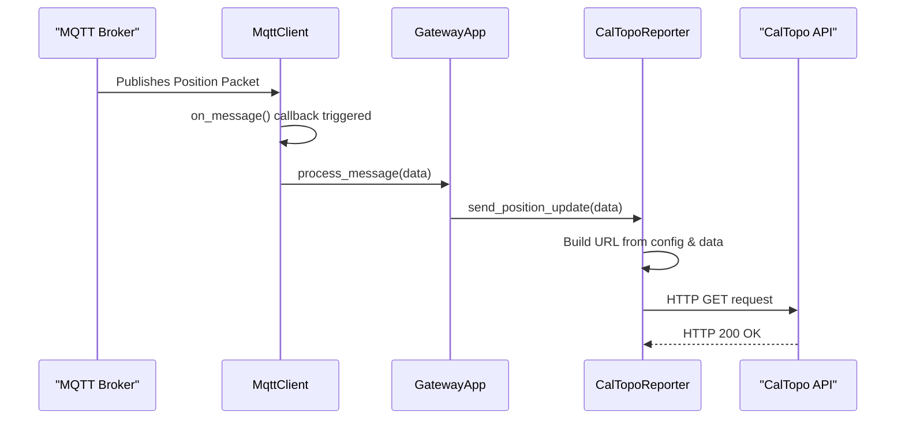

# **Software Design Document: Meshtastic-to-CalTopo Gateway**

* **Project:** `meshtopo`
* **Version:** 1.0
* **Date:** October 9, 2025
* **Author:** Clayton Auld

***

## 1. Introduction

### 1.1 Purpose

This document provides a detailed technical design for the **meshtopo** gateway. It is intended for software engineers responsible for implementation and project managers seeking to understand the system's architecture, features, and scope.

### 1.2 Problem Statement

Backcountry coordinators, event organizers, and response teams often use a mix of off-grid communication tools like **Meshtastic (LoRa)** and online mapping platforms like **CalTopo**. There is no direct bridge between these two systems, making it difficult to achieve real-time situational awareness of field assets on a shared, high-quality map. This project solves that problem by creating a lightweight, reliable software gateway to forward location data from a Meshtastic network directly to a CalTopo map.

### 1.3 Scope

* **In-Scope:** The gateway will connect to an MQTT broker, subscribe to Meshtastic position topics, parse the data, and forward it to the CalTopo Position Report API. The application will be configurable, log its status, and be deployable as a Docker container.
* **Out-of-Scope:** This project will not involve any modification of the Meshtastic firmware. It will not provide a user interface beyond terminal logging. Two-way communication from CalTopo back to Meshtastic is a potential future enhancement but is not part of this version.

### 1.4 License

This project will be licensed under the **GNU Affero General Public License v3 (AGPLv3)**. This is a strong copyleft license chosen to ensure that the source code, including any derivative works or modifications used to provide a network service, remains open and available to the community.

***

## 2. System Architecture

The system operates on a simple, linear data flow model composed of four distinct components.

1. **Meshtastic Network**: A decentralized mesh network of LoRa nodes. At least one node is configured as an "MQTT Gateway," connecting to a local WiFi network to forward all network traffic.
2. **MQTT Broker**: A central message broker (e.g., Mosquitto) that acts as the intermediary. It receives all data from the Meshtastic MQTT Gateway and allows other clients, like our service, to subscribe to this data stream.
3. **Gateway Service (This Project)**: The core application. A Python service that subscribes to the MQTT broker, intelligently filters for position packets, transforms the data, and executes API calls to CalTopo.
4. **CalTopo API**: A cloud-based API endpoint provided by CalTopo that accepts position reports via HTTP GET requests and plots them on a specified map layer.

***

## 3. Requirements

### 3.1 Functional Requirements (FR)

* **FR-1**: The system **shall** connect to an MQTT broker using credentials provided in a configuration file.
* **FR-2**: The system **shall** subscribe to a configurable MQTT topic pattern to capture Meshtastic JSON packets.
* **FR-3**: The system **shall** parse incoming JSON payloads to extract node ID, latitude, longitude, and timestamp.
* **FR-4**: The system **shall** maintain a mapping of Meshtastic Node IDs to CalTopo Device IDs, as defined in the configuration file.
* **FR-5**: The system **shall** construct a valid CalTopo Position Report API URL.
* **FR-6**: The system **shall** send an HTTP GET request to the constructed URL for each valid position packet received from a mapped node.

### 3.2 Non-Functional Requirements (NFR)

* **NFR-1**: All operational parameters (MQTT/CalTopo details, node mappings) **shall** be externally configurable via a `config.yaml` file.
* **NFR-2**: The application **shall** log key events, including successful connections, data processing, and API submissions.
* **NFR-3**: The application **shall** handle and log common errors gracefully (e.g., MQTT disconnection, API unavailability, malformed data).
* **NFR-4**: The application **shall** be deployable as a self-contained Docker container.
* **NFR-5**: The application **shall** be lightweight, with minimal CPU and memory footprint.

***

## 4. Detailed Design

### 4.1 Software Stack

* **Language**: **Python 3.9+**. Chosen for its rapid development, excellent library support, and suitability for I/O-bound tasks.
* **Key Libraries**:
  * `paho-mqtt`: The de facto standard for MQTT communication in Python.
  * `requests`: Simplifies making HTTP requests to the CalTopo endpoint.
  * `PyYAML`: For safe and easy loading of the `config.yaml` file.

### 4.2 Class Structure

The application will be built using an object-oriented approach to separate concerns.

* `**GatewayApp**`: The main class and entry point.
  * Responsibilities: Orchestrates the application lifecycle. Initializes all other components, starts the MQTT client, and handles graceful shutdown.
* `**Config**`: A data class to hold validated configuration loaded from `config.yaml`.
* `**MqttClient**`:
  * Responsibilities: Manages the entire lifecycle of the MQTT connection, including connecting, subscribing, and handling the `on_message` callback.
* `**CalTopoReporter**`:
  * Responsibilities: Contains the logic for interacting with the CalTopo API. It receives parsed position data, looks up the correct Device ID, constructs the API URL, and executes the HTTP GET request.

### 4.3 Sequence Diagram

This diagram shows the process for handling a single position packet.



***

## 5. Data Models & Interfaces

### 5.1 Input: Meshtastic MQTT JSON

The gateway will process JSON objects from the `msh/.../json/position/#` topic. It will primarily extract `fromId` and the `payload` object.

```json
{
  "fromId": "!823a4edc",
  "type": "position",
  "payload": {
    "latitude_i": 612188460,
    "longitude_i": -1499001320
  }
}
````

*Note: `latitude_i` and `longitude_i` must be divided by `1e7` to get decimal degrees.*

### 5.2 API Interface: CalTopo Position Report

The service will make an HTTP GET request to the following endpoint.

* **Method**: `GET`
* **Endpoint**: `https://caltopo.com/api/v1/position/report/{GROUP}`
* **Query Parameters**:
  * `id`: The `{DEVICE ID}` of the node.
  * `lat`: Latitude in decimal degrees.
  * `lng`: Longitude in decimal degrees.
* **Example URL**: `https://caltopo.com/api/v1/position/report/MESH-TEAM-ALPHA?id=TEAM-LEAD&lat=61.2188460&lng=-149.9001320`

-----

## 6. Configuration Management

The system will be configured via a single `config.yaml` file.

```yaml
# config.yaml

# Configuration for the MQTT Broker connection
mqtt:
  broker: "192.168.1.100"
  port: 1883
  username: "your_mqtt_user"
  password: "your_mqtt_password"
  topic: "msh/+/+/json/position/#"

# Configuration for the CalTopo API
caltopo:
  group: "MESH-TEAM-ALPHA"

# Mapping of Meshtastic hardware IDs to CalTopo device IDs.
nodes:
  "!823a4edc":
    device_id: "TEAM-LEAD"
  "!a4b8c2f0":
    device_id: "COMMS"
```

-----

## 7. Error Handling & Logging

| Scenario                    | Trigger                                       | Action                                                  | Log Level |
| --------------------------- | --------------------------------------------- | ------------------------------------------------------- | --------- |
| **MQTT Disconnection** | Network loss, broker restart                  | Attempt to reconnect with exponential backoff.          | `WARN`    |
| **Invalid JSON** | Corrupted message from MQTT broker            | Discard the message and log the payload for debugging.  | `WARN`    |
| **Unmapped Node ID** | Position packet received from an unknown node | Discard the message. (Log as `DEBUG` to avoid spam).    | `DEBUG`   |
| **CalTopo API Unreachable** | No internet, DNS failure, CalTopo is down     | Log the error and the failed URL, then drop the packet. | `ERROR`   |
| **CalTopo API Error** | HTTP 4xx or 5xx response from CalTopo         | Log the error, status code, and response body.          | `ERROR`   |
| **Successful Post** | HTTP 200 OK from CalTopo                      | Log the node ID and successful submission.              | `INFO`    |

-----

## 8. Deployment

The recommended deployment method is via Docker for process isolation and dependency management.

### 8.1 Dockerfile

```dockerfile
FROM python:3.9-slim
WORKDIR /app
COPY requirements.txt .
RUN pip install --no-cache-dir -r requirements.txt
COPY . .
CMD [ "python", "gateway.py" ]
```

### 8.2 Docker Compose

A `docker-compose.yml` file will be provided for easy one-command startup.

```yaml
version: '3.7'
services:
  meshtopo:
    build: .
    container_name: meshtopo
    restart: unless-stopped
    volumes:
      - ./config.yaml:/app/config.yaml
```

-----

## 9. Future Enhancements

* **Two-Way Messaging**: Implement a mechanism to send short text messages back to the Meshtastic network.
* **Status Reporting**: Forward additional Meshtastic telemetry (e.g., battery level, signal strength) to CalTopo.
* **Web Status Page**: A simple web UI to show the status of the gateway, last seen positions, and logs.
